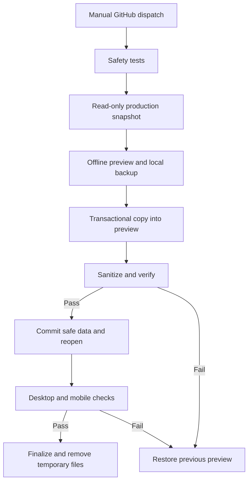

# Manual preview database refresh

This is a one-way snapshot, not a shared database or ongoing synchronization.

## Entry points

The dedicated workflow is `.github/workflows/preview-database-refresh.yml`, named **Refresh Preview Data**. It has manual dispatch and no schedule/push execution. Its PR safety tests do not connect to Hostinger.

Until the new workflow exists on the default branch, use the already registered **Staging SSH preflight** workflow, select the feature branch, and choose **refresh-preview-database**. That manual entry point calls the same reusable refresh workflow from the selected commit. No merge or production deployment is needed to test it. After an approved merge, the dedicated entry is available directly.

No database-name input is accepted. Fixed production source: `u304629909_tinggaljalan`; fixed target: `u304629909_tj_preview`. The tested feature revision is deployed to preview before first execution, adding a staging-only Laravel HTTP fail-closed guard for overlooked integrations such as exchange-rate lookup. Production behavior is unchanged. The application keeps its preview environment, APP_KEY, DB user, storage, cookies, and Basic Auth. The refresh never boots the production application.

## Copy and recovery

The runner sends reviewed helpers and existing staging credentials over pinned SSH. Production credentials stay on Hostinger, read from its existing private environment file only by the refresh helper. The production PDO connection enters a repeatable-read, read-only consistent snapshot. Only SELECT/SHOW statements read that connection; all mutations use a separate PDO connection authenticated as the preview database user.

The helper shares the existing staging filesystem lock and GitHub concurrency group. It rejects unknown tables/columns, differing schemas, non-InnoDB tables, views, triggers, symlinks, unexpected roots, missing protection, unsafe effective configuration, and detected preview queue/scheduler processes.

An atomic web-server 503 gate covers all preview requests, including `/up` and static assets. A Laravel maintenance file adds another gate. Authenticated HTTP must confirm 503 before any copy. The previous preview rows are backed up in a private Hostinger-only gzip JSONL file (directory 0700, file 0600) with a SHA-256 integrity check. No raw production dump is created and no DB backup is uploaded to GitHub.

Copy, sanitization, and data verification run in one preview transaction. Unsanitized rows are never committed. On failure the transaction rolls back; after a committed copy, the verified previous backup restores the database before reopening. A durable private pending record keeps rollback available across process interruptions. If restoration fails, the web gate remains closed. A new run encountering pending state restores it and fails; rerun after recovery to refresh again.

Browser or production-health verification failure invokes host rollback. Abrupt runner/SSH loss can leave pending state; subsequent recovery requires SSH to be available. There is deliberately no automatic scheduler.

The current and two most recent other preview backups are retained privately on Hostinger after successful verification. Only exact preview-backup filenames in the canonical preview backup directory can be pruned. These backups may contain previous preview test data and must remain private.

## Sanitization policy

| Data | Preview policy |
|---|---|
| Production users/password hashes/remember tokens | Delete all; create only `preview-admin@tinggaljalan.test` with existing staging admin password |
| Password reset tokens and sessions | Delete, including IP/user-agent/session payloads |
| Cache, queued/failed jobs and job batches | Delete opaque payloads; clear preview file cache and sessions |
| Bookings | Replace codes, names, and emails with preview placeholders; clear phone/country, exact travel date, pickup details, notes, add-on snapshots, voucher code, gateway and notification timestamps/errors |
| Booking payment records | Delete all provider IDs, tokens, links, raw payloads, bank/payment/receipt/contact data |
| Customer reviews | Replace reviewer names/text; clear origin/source; retain ratings and counts |
| Package testimonials/review source | Clear nested customer material |
| Availability notes/reasons | Clear private free text; retain dates, seats and statuses |
| Generic settings | Delete opaque values without a reviewed public schema |
| Email and WhatsApp settings | Force disabled; clear credentials, endpoints, accounts, session IDs and test diagnostics; disable manual WhatsApp fallback |
| Notification settings | Force all channels disabled; clear admin destinations |
| Payment settings | Disable every gateway and manual transfer; sandbox mode; clear public/secret keys and bank accounts |
| Website contacts | Replace email with `.invalid`; clear phone/address/map link |
| Private vouchers | Replace code/label; clear public text; retain discount rules |
| Tourism/business content | Keep destinations, routes, package descriptions/prices, tiers, itineraries, add-ons, availability, news, public promotions and published business profiles |

Only referenced uploaded tourism images from explicit public image columns are copied. They are validated as images, confined to production public storage, and stored under content-hashed names in separate preview storage. Existing preview images are never overwritten. The durable pending record includes hashes of the existing preview-owned originals and derivatives. Rollback restores the DB, removes only additions within the managed namespaces, and verifies all prior bytes remain unchanged before reopening. Private media/payment receipts and production logs/storage/session files are never bulk-copied. Files added by a failed refresh are removed during coordinated rollback; older content-hashed media remains available to retained database backups.

The schema manifest was derived from the actual Hostinger audit. A new table or column fails before refresh until its policy is reviewed. Public business content is treated as intentionally publishable; sanitization is not a semantic PII detector for arbitrary prose in published content.

## Verification

Disposable MySQL tests exercise the actual PDO helpers, dirty production-shaped fixtures, unknown-table/column rejection, identifier safety, read-only write rejection, retention of prices/counts, sanitization, credential/toggle tampering, backup permissions/integrity, transaction rollback, and committed-copy backup restoration. Standard repository PHP and cross-browser PR CI also runs.

The live workflow verifies actual preview DB and gateway rejection, then reuses rendering checks and synthetic booking/admin checks on desktop/mobile. Its booking test selects a valid priced package from the refreshed data. Only sanitized browser screenshots/diagnostics become GitHub artifacts, after successful verification. Passwords, private config, DB rows and dumps are excluded.

Production `/up` must remain healthy at the same revision before and after; its environment file hash and deployed revision must remain unchanged on Hostinger. These checks establish that this operation did not deploy or change production configuration. Normal production traffic can still create bookings while the read-only snapshot runs.

The existing Hostinger source DB account has normal production privileges; this helper constrains its connection to a read-only transaction. A separately provisioned SELECT-only DB account would add database-level defense against future helper changes. No new persistent production access is created here.

## Complete preview data and media

The directory allowlist follows the actual upload forms: `admin/hero`, `admin/packages/covers`, `admin/packages/gallery`, `admin/destinations/covers`, `admin/news/covers`, `admin/about` (including team and milestones), `admin/site`, and `admin/platform-links/logos`. Only DB-referenced images within these directories are copied. About-page hero/story/SEO JSON images, platform logos and site logos are covered alongside the original six models. Generic `uploads`, payment/private media, framework files, logs, compiled views, queues and sessions are never copied. Raster images must decode; uploaded SVG logos must be passive XML without scripts, event handlers, external references or entities.

Canonical images are copied host-side under SHA-256 filenames in `admin/preview-refresh`. Generated WebP files are created in `generated/storage/admin/preview-refresh` using the same `ResponsiveImageGenerator` behavior as `images:generate-responsive`, scoped only to referenced copied originals. Every required local reference and all five derivative widths must resolve and validate before reopening. Null/empty optional images and legitimate external references are accepted; repository assets are verified from the deployed release rather than copied from production. Symlinks, traversal, aliasing source/target storage and unknown local media paths fail closed.

The DB uses one read-only snapshot. Its exact referenced originals are copied with source/destination hash checks before and after each copy. A concurrent deletion or file change fails and rolls back; there is no need for a bulk two-pass storage sync because files are immutable in preview and only snapshot-referenced originals are copied. This provides a practical snapshot without freezing production uploads or introducing another synchronization service.

Known link fields (hero buttons, About CTAs, platform URLs and team profile URLs) are reviewed separately from arbitrary prose. Production-origin public links become relative preview links. Contact actions and production payment/admin/callback/token links are neutralized. Legitimate external business links remain unchanged; body prose is not blindly rewritten.

A browser media check forces local images to load on home, routes, news and About pages at desktop/mobile sizes, checks browser decoding and selected responsive variants, and rejects production media references. Existing rendering, booking/admin and production-health checks still run. Dirty queue/cache/session fixtures and coordinated DB/media rollback are tested against disposable MySQL; public storage is never bulk copied.

Staging application contact helpers return an inert link and omit the server-rendered hardcoded production WhatsApp link, even if the database contains a real number. Production contact behavior is unchanged. The host helper refuses to refresh until this application guard is deployed, and the browser media check rejects active WhatsApp actions.
